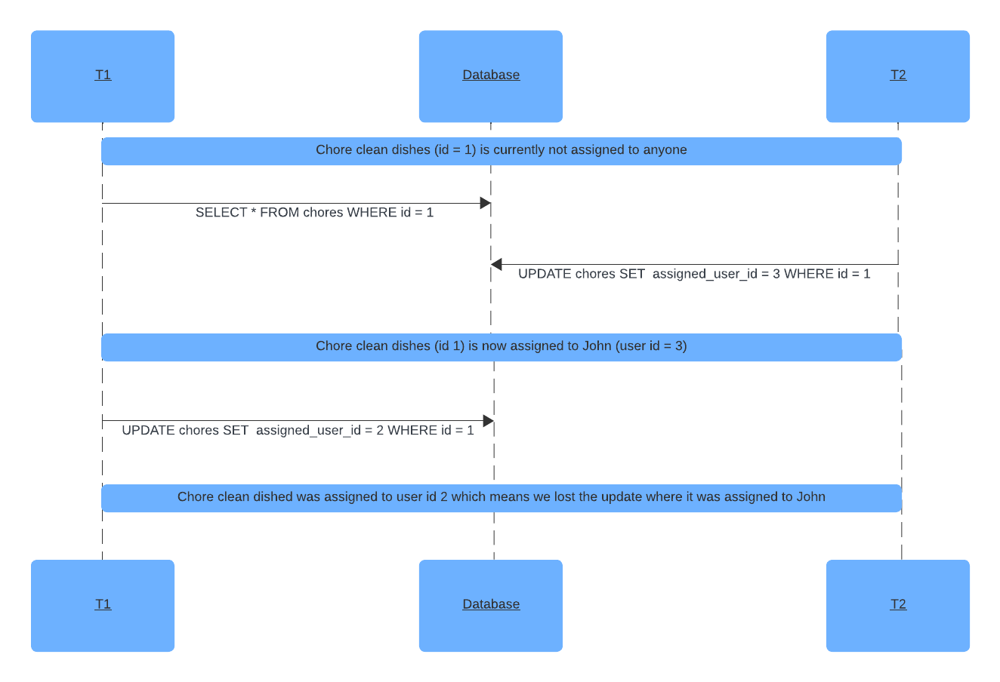
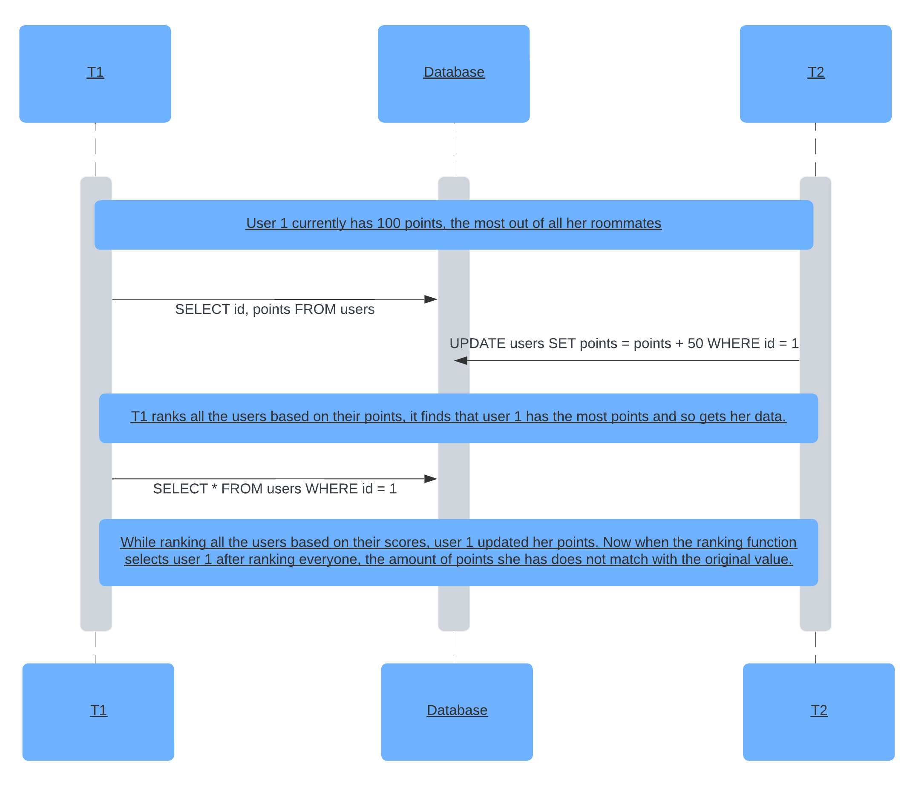
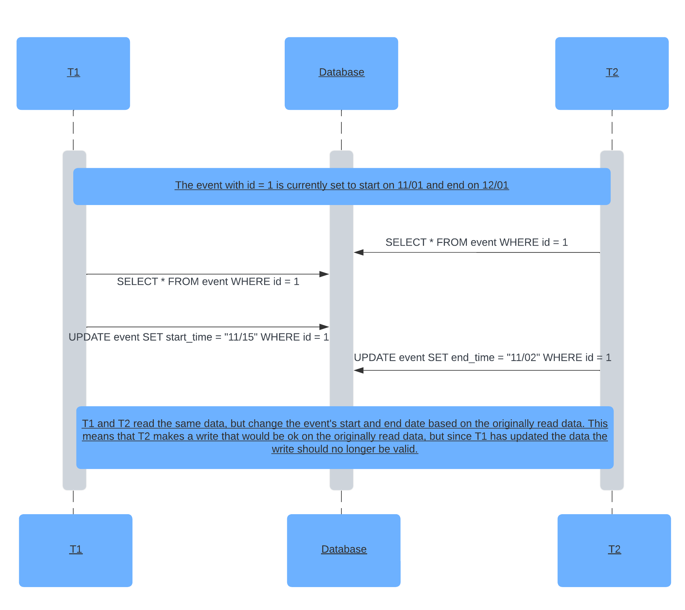

### Concurrency Issues

## 1
One possible concurrency issue that our endpoints have is when two roommates try to claim a chore at the same time. One transaction would check if the chore has nobody assigned to it and before it finishes another transaction would update the same chore and assign it to another roommate. Then, the first transaction would assign the first roommate to the task because it is still under the assumption that no one is assigned to the task. This would mean the previous update would be lost. This issue could be solved by using pessimistic concurrency control. This would lock the row that is being edited from being edited by another transaction until the original transaction is done editing it. This would ensure that an update would not be lost. 

## 2
Another issue is with our points endpoints. The first transaction is reading the points of the roommates in a room to get the rankings. After the first transaction does its first read of the data, a second transaction updates the point value of the roommate that is ranked first because they just completed a chore. Now, when the first transaction goes to get the data of the roommate that is ranked 1, they will have a different point value than they had in the original read. This error would be a non-repeatable read. This issue can be fixed by setting the isolation level to Repeatable Read. This would ensure that the non-repeatable read issue would not occur because it would ensure that reads within the same transaction will return the same data.  

## 3
Another issue of concurrency is in our calendar endpoints. There can be a write skew issue when one transaction reads a row for a calendar event. After, another transaction starts that updates the start time of that event. This update goes through to the database and then the first transaction changes the end date of the event to a date that is now invalid because it is still based on the data from the original read before it was updated. This issue can also be solved with pessimistic concurrency control because it would block the row from being read or edited by any other transaction until the original transaction is completed. This means the second transaction would not be able to read the event times and update them, so the first transaction would still be valid.

